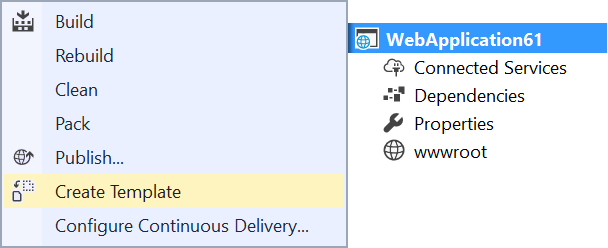
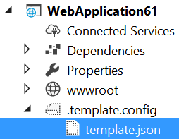

# SideWaffle Template Creator

<!--BadgesSTART-->
<!-- Powered by https://github.com/GregTrevellick/ReadMeSynchronizer -->

 
    

 
<!--BadgesEND-->

Download this extension from the [VS Marketplace](https://marketplace.visualstudio.com/items?itemName=Sayed-Ibrahim-Hashimi.SidewaffleCreator2017)

---------------------------------------

Makes it easy to create custom project templates for 'dotnet new' and Visual Studio.

Read more about the [new template format here](https://blogs.msdn.microsoft.com/dotnet/2017/04/02/how-to-create-your-own-templates-for-dotnet-new/) and how to create and customize your templates. This extension makes it easy to get started, but you need to understand how the underlying templating system works to take full advantage of it.

## Features

- Generate template file
- Add Visual Studio host file

### Generate template file
Right-click the project you want to turn into a template and click *Create Template...*.

That will create a folder called *.template.config* and add a file called *template.json* to it. The folder is not being added to the project, but exist on disk in the root of the project directory.

## License
[Apache 2.0](LICENSE)
